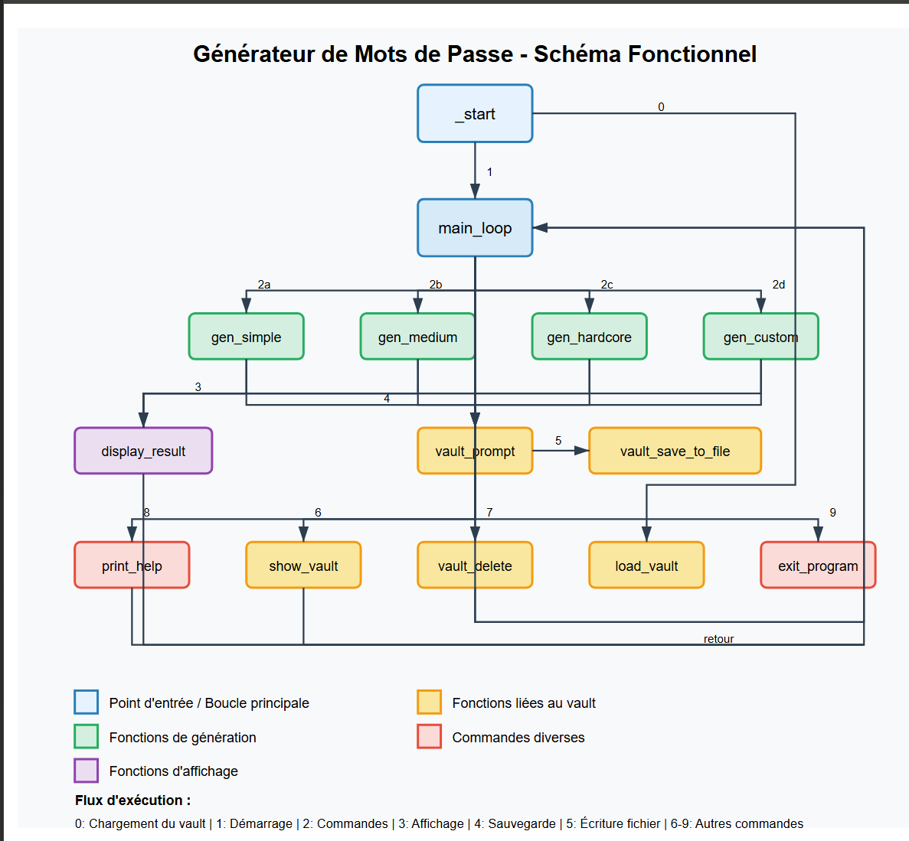

# Générateur de mots de passe avec gestion persistante du Vault

Ce programme, écrit en NASM pour Linux (architecture x86_64), permet de générer des mots de passe selon différents critères et de les sauvegarder de manière persistante dans un fichier (`vault.txt`). Il propose une interface en ligne de commande interactive offrant plusieurs commandes pour générer, afficher ou vider le vault.

## Table des matières

- [Fonctionnalités](#fonctionnalités)
- [Structure du code](#structure-du-code)
  - [Section .data](#section-data)
  - [Section .bss](#section-bss)
  - [Section .text et routines principales](#section-text-et-routines-principales)
- [Schéma fonctionnel](#schéma-fonctionnel)
- [Compilation](#compilation)
- [Exécution et utilisation](#exécution-et-utilisation)
  - [Exécution](#exécution)
  - [Commandes disponibles](#commandes-disponibles)
  - [Gestion du Vault](#gestion-du-vault)
- [Détails techniques](#détails-techniques)
  - [Génération de nombres pseudo-aléatoires](#génération-de-nombres-pseudo-aléatoires)
  - [Appels système utilisés](#appels-système-utilisés)
- [Remarques et améliorations possibles](#remarques-et-améliorations-possibles)

## Fonctionnalités

### Génération de mots de passe

Le programme offre plusieurs modes de génération :

- **Simple** : 8 caractères (lettres et chiffres).
- **Medium** : 10 caractères (incluant des caractères spéciaux).
- **Hardcore** : 20 caractères (avec un mélange complet de lettres, chiffres et caractères spéciaux).
- **Custom** : L'utilisateur définit la longueur et choisit quels types de caractères inclure (minuscules, majuscules, chiffres, spéciaux).

### Sauvegarde persistante (Vault)

Après chaque génération, l'utilisateur peut choisir de sauvegarder le mot de passe avec un nom personnalisé. Les entrées sont enregistrées en mémoire et ajoutées au fichier `vault.txt` pour être restaurées lors des exécutions futures.

### Gestion du Vault

- La commande `vault` affiche les mots de passe sauvegardés avec leur nom.
- La commande `vault delete` vide le fichier de sauvegarde et réinitialise le vault en mémoire.

## Structure du code

### Section .data

Cette section contient toutes les chaînes de caractères et constantes utilisées par le programme, notamment :

- **Messages d'accueil et d'instructions**
  - `welcome_msg` : Message de bienvenue.
  - `commands_msg` : Liste des commandes disponibles.
  - `prompt_msg` : Invite pour saisir une commande.
  - Messages d'erreur et de succès (ex. : `success_msg`, `unknown_cmd_msg`).

- **Ensembles de caractères**
  - `allowed_chars` pour le mode simple.
  - `allowed_medium_chars` pour les modes medium et hardcore.

- **Commandes et invites spécifiques au Vault**
  - `vault_str` pour afficher le vault.
  - `vault_delete_str` pour la commande de suppression du vault.
  - `vault_save_prompt` et `vault_name_prompt` pour la sauvegarde d'un mot de passe.
  - Messages tels que `empty_vault_msg` et `vault_deleted_msg`.

### Section .bss

Cette section réserve la mémoire pour :

- **Buffers de saisie et de génération**
  - `input_buffer` pour la lecture de la commande utilisateur.
  - Buffers pour stocker les mots de passe générés.

- **Variables de contrôle et stockage**
  - `seed` : Utilisé pour la génération pseudo-aléatoire.
  - `vault_storage` : Zone mémoire pour stocker les entrées du vault.
  - `vault_offset` : Indique la taille actuelle des données sauvegardées.
  - `name_input` : Pour la saisie du nom associé à une entrée.

### Section .text et routines principales

- **Point d'entrée (`_start`)**
- **Boucle principale (`main_loop`)**
- **Routines de génération de mots de passe**
- **Gestion du Vault**
- **Affichage du résultat (`display_result`)**

## Schéma fonctionnel

Le schéma ci-dessous illustre les interactions entre les différentes fonctions du générateur de mots de passe :



### Explication du schéma

Le schéma représente le flux d'exécution du programme avec les composants suivants :

- **Point d'entrée et boucle principale** (bleu) : Les fonctions `_start` et `main_loop` qui contrôlent l'exécution.
- **Fonctions de génération** (vert) : Les différents modes de génération de mots de passe (`gen_simple`, `gen_medium`, `gen_hardcore`, `gen_custom`).
- **Fonctions d'affichage** (violet) : La fonction `display_result` qui montre le mot de passe généré.
- **Fonctions liées au vault** (jaune) : Les fonctions qui gèrent la sauvegarde et l'affichage des mots de passe (`vault_prompt`, `vault_save_to_file`, `show_vault`, `vault_delete`, `load_vault`).
- **Commandes diverses** (rouge) : Les fonctions `print_help` et `exit_program`.

Le flux d'exécution est numéroté pour indiquer l'ordre des opérations :
0. Chargement du vault depuis le fichier
1. Initialisation et démarrage du programme
2. Analyse de la commande utilisateur
3. Affichage du mot de passe généré
4. Proposition de sauvegarde
5. Écriture dans le fichier vault
6-9. Gestion des autres commandes

Après chaque opération, le programme revient à la boucle principale (`main_loop`) pour attendre une nouvelle commande.

## Compilation

Assurez-vous que NASM et ld sont installés sur votre système Linux.

```bash
nasm -f elf64 generateur.asm -o generateur.o
ld generateur.o -o generateur
```

## Exécution et utilisation

### Exécution

Lancez le programme depuis le terminal :

```bash
./generateur
```

Au démarrage, le programme tente de charger le contenu du fichier `vault.txt` afin de restaurer les entrées sauvegardées.

### Commandes disponibles

| Commande       | Description |
|---------------|-------------|
| `simple`      | Génère un mot de passe de 8 caractères (Chiffres & lettres minuscules & majuscules). |
| `medium`      | Génère un mot de passe de 10 caractères (Chiffres & lettres minuscules & majuscules + caractères spéciaux). |
| `hardcore`    | Génère un mot de passe de 20 caractères (Chiffres & lettres minuscules & majuscules + caractères spéciaux). |
| `custom`      | Génération personnalisée avec choix de longueur et types de caractères. |
| `vault`       | Affiche les mots de passe sauvegardés. |
| `vault delete`| Vide le fichier vault.txt et réinitialise la mémoire. |
| `help`        | Affiche la liste des commandes. |
| `exit`        | Quitte le programme. |

### Gestion du Vault

Le vault est géré de deux manières :

- **En mémoire** : Les entrées sont stockées dans `vault_storage`.
- **Dans le fichier (`vault.txt`)** :
  - Les entrées sont ajoutées en mode append.
  - La commande `vault delete` ouvre le fichier en mode écriture avec troncation, et supprime le contenu du vault.txt.

## Détails techniques

### Génération de nombres pseudo-aléatoires

- **Utilisation de `rdtsc`** : Lecture du compteur de cycles du processeur.
- **Algorithme LCG** : Génération d'une suite de nombres pseudo-aléatoires.

### Appels système utilisés

| Syscall     | Description |
|------------|-------------|
| `sys_read (0)`  | Lecture de l'entrée utilisateur. |
| `sys_write (1)` | Affichage à l'écran et écriture dans le fichier. |
| `sys_open (2)`  | Ouverture des fichiers en lecture ou écriture. |
| `sys_close (3)` | Fermeture des fichiers ouverts. |
| `sys_exit (60)` | Quitte le programme. |

## Remarques et améliorations possibles

### Robustesse et gestion d'erreurs

Ajout de messages d'erreur plus détaillés pour chaque appel système.

### Sécurité de la génération aléatoire

L'utilisation de `/dev/urandom` serait plus sûre que `rdtsc` et LCG.

### Interface utilisateur

Possibilité d'améliorer la saisie utilisateur ou de développer une interface graphique.

### Extension du Vault

Le buffer actuel est de 1024 octets. Une gestion dynamique de la mémoire pourrait être envisagée.